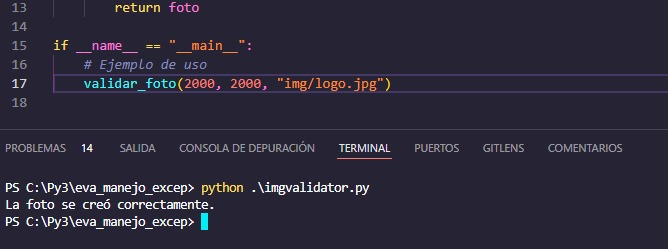
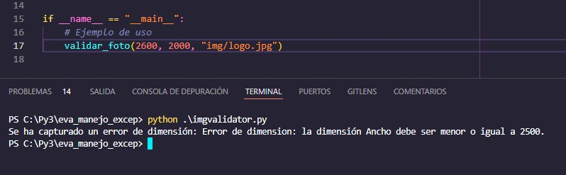
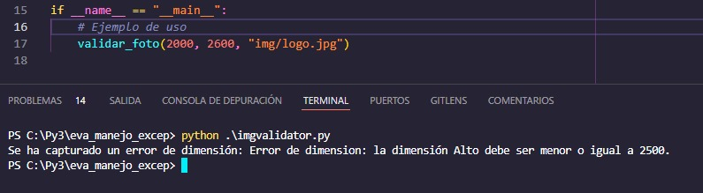

# Evaluación  - Manejo de Excepciones

Dentro de este proyecto se apoya de un codigo base en el cual debemos ejecutar y detectar excepciones y errores para asi iterarlos y mostrarlos en la termina.
Para este ejemplo trabajaremos con alto y ancho que se asignaran a aun archivo tipo imagen (jpg,png, webm, entre otros.).
Para la ejecucion de este codigo se tiene que considerar modificar 2 o 3 parametros dentro del proyecto.


### ./imgvalidator.py

Los parametros a modificar son los siguiente

```bash
  ...
  if __name__ == "__main__":
    # Ejemplo de usollo
    validar_foto(2000, 2600, "img/logo.jpg")
```


### Ejecucion

Para la ejecucion basta con ejecutar el siguiente codigo dentro de nuestra terminal luego de haber modificado los parametros señalados en el punto anterior.
```bash
  python imgvalidator.py
```

### Resultados esperados





